# Wordpress API

Detalhamento de como realizar as requisições usando o Insomnia.

## Usuário
### GET - visualização
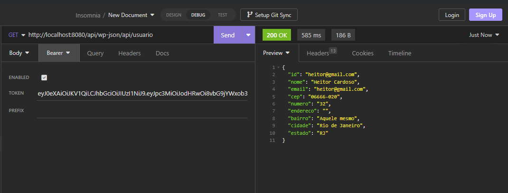

### POST - cadastro
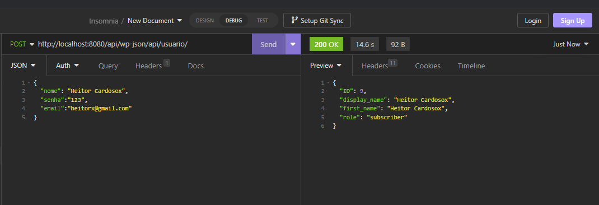

### PUT
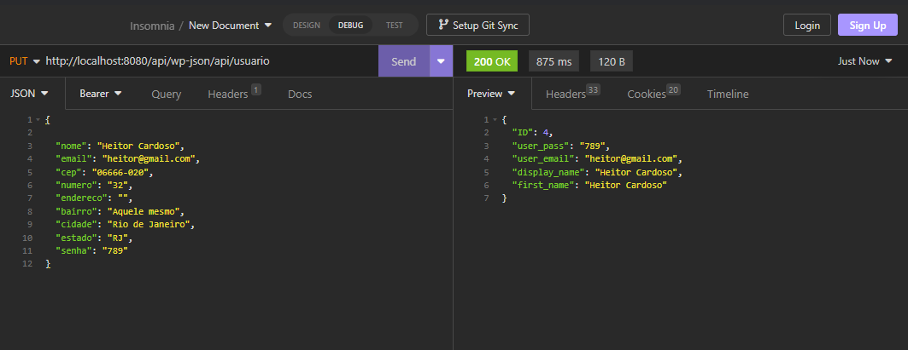
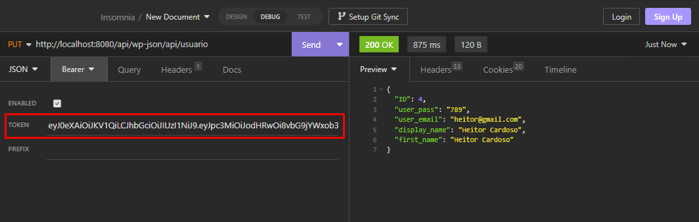

### Validando sobre o TOKEN
### POST - irá retornar o token se for um usuário válido
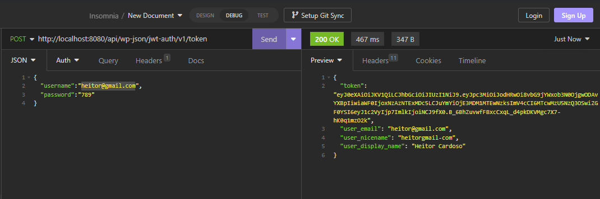

### POST - validando se o token está ou não expirado, na página de functions tem uma função customizada que gera um novo token a cada um dia.

token inválido
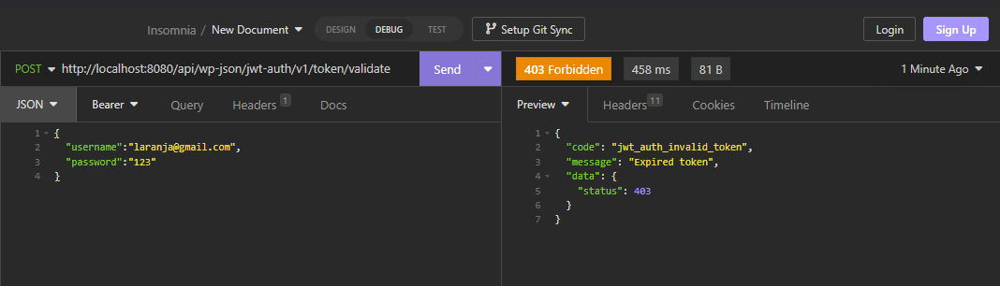
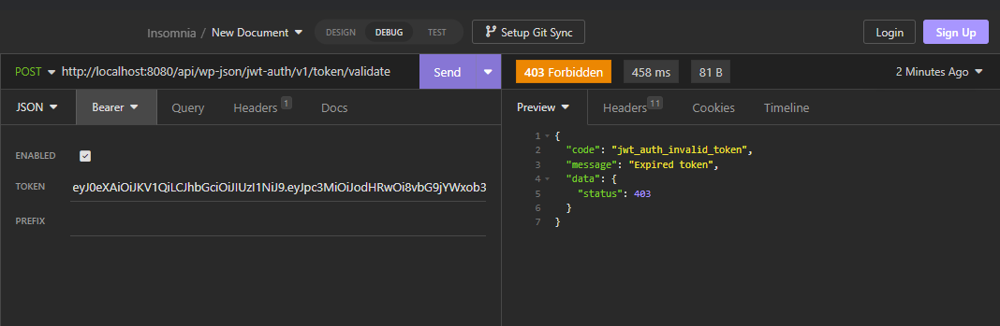

token válido
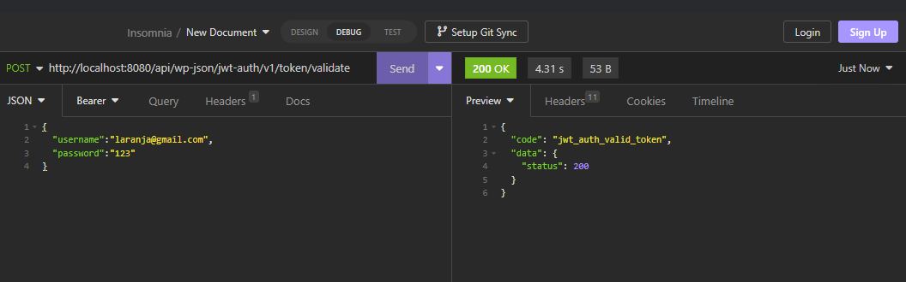
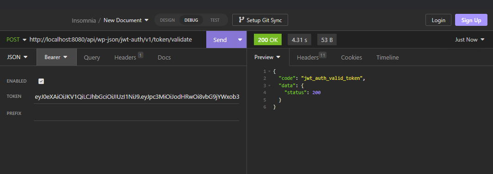

## Produto
### GET - retorna um único produto
Ponto de atenção : Não há necessidade de informar o JWT para a busca apenas no cadastro e na exclusão.
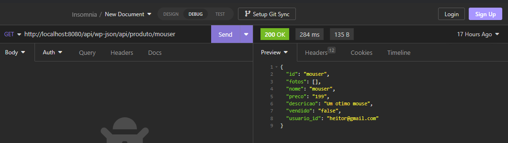

retorna todos os produtos cadastrados por aquele usuário passado por query parameters
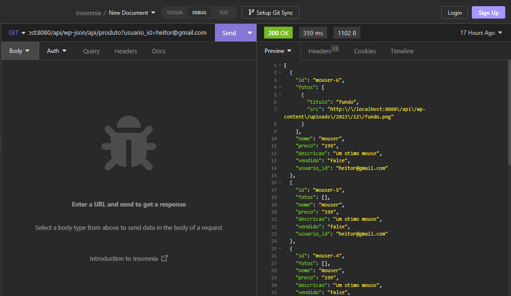

### POST - precisa ser um JWT válido para cadastrar
JWT inválido
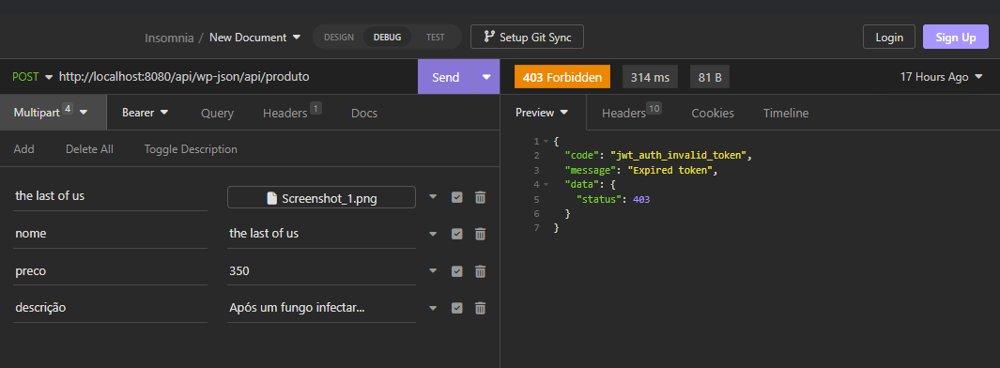
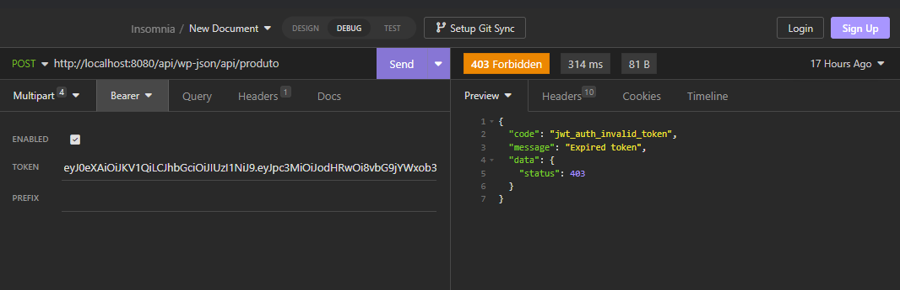

JWT válido
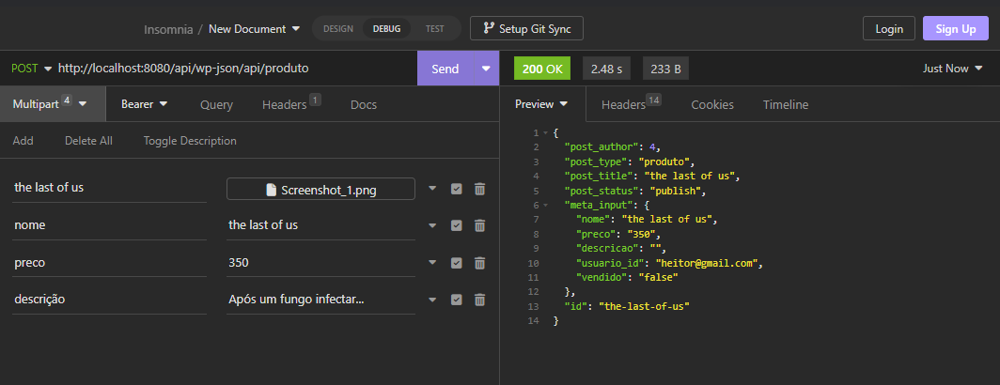
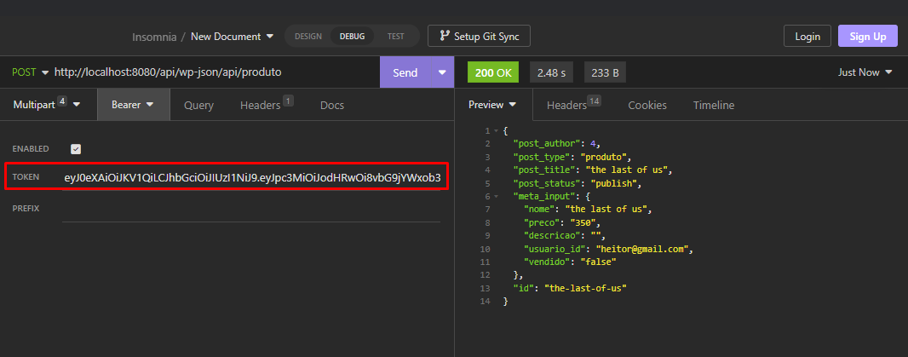

### DELETE
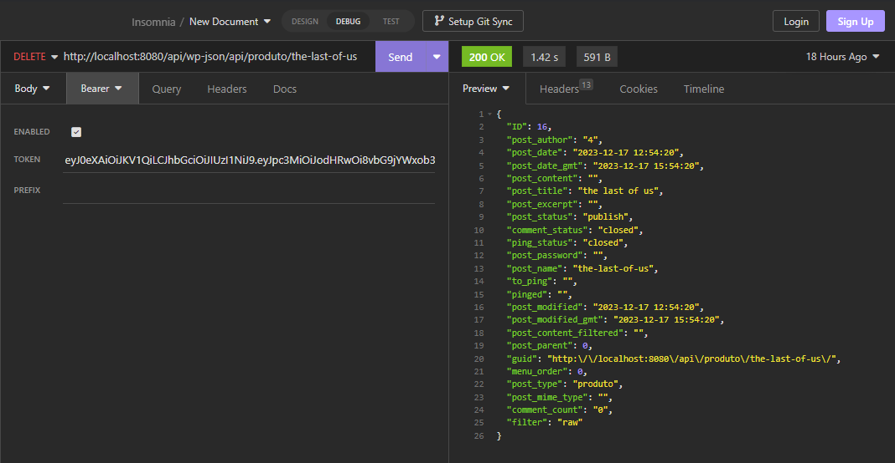

## Transacão
### POST
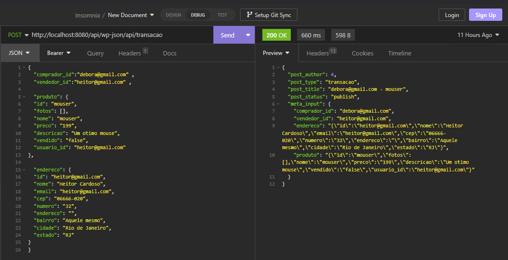
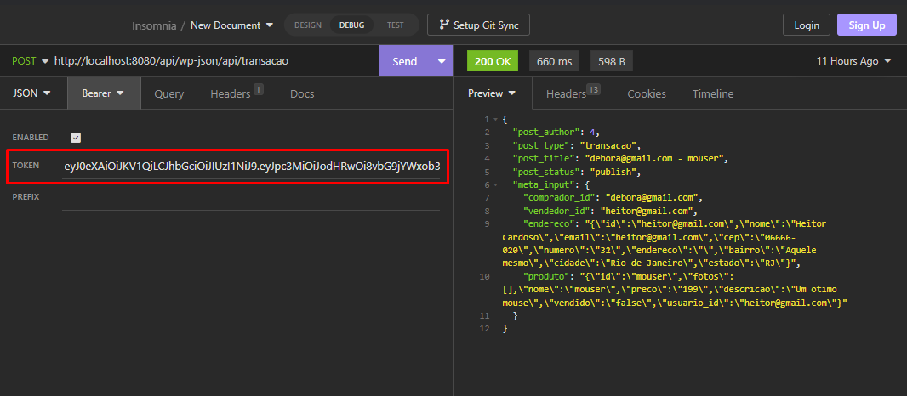

### GET
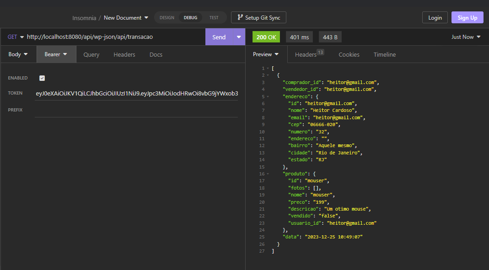

Por padrão o tipo está como comprador_id quando não for passado, mas se desejar pode filtrar por vendedor_id através de query paramters
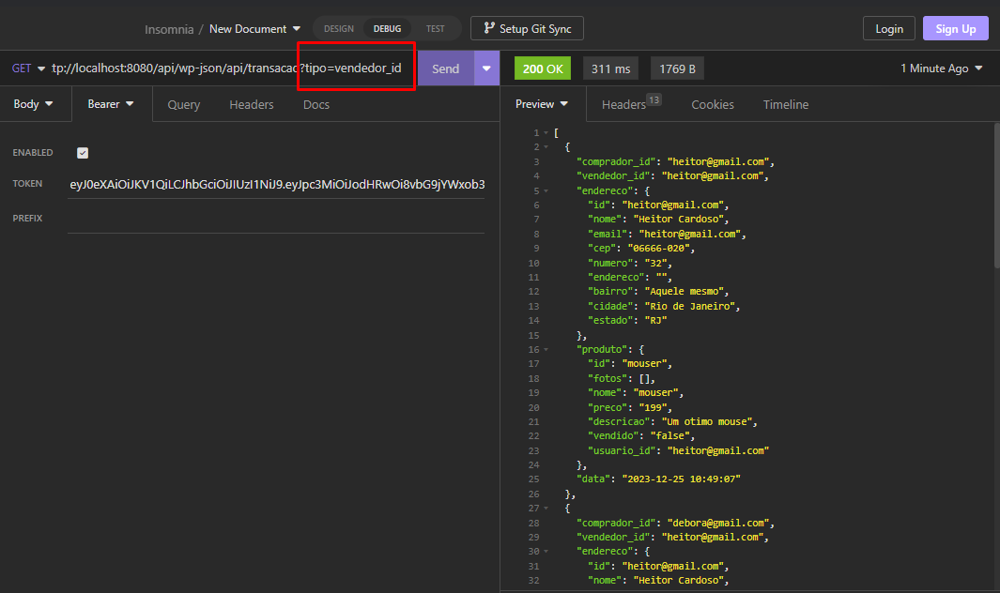

